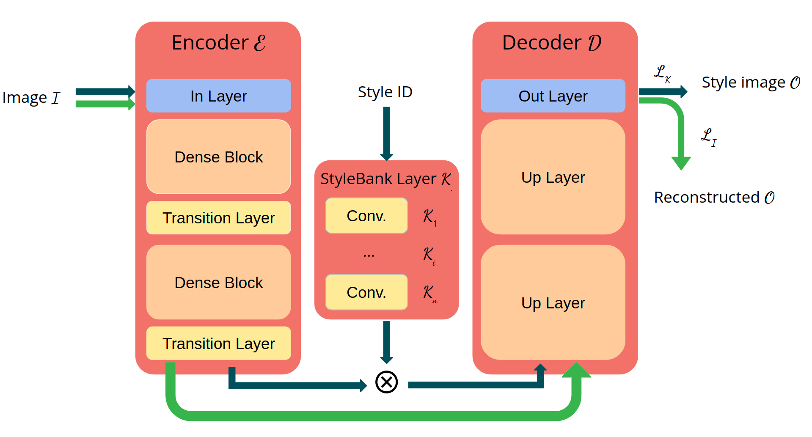
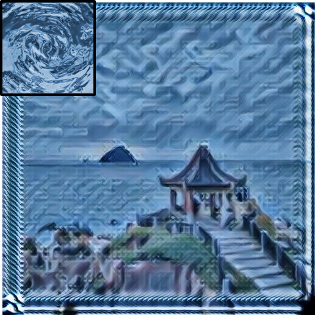
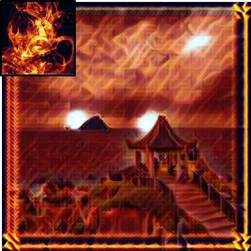

### Introdution

This project reproduce [Stylebank](https://doi.org/10.48550/arXiv.1703.09210), and try to improve it with [densenet](https://doi.org/10.48550/arXiv.1608.06993) and other approaches.

### Structure Overview

 

### Demo

Here's part of the result, more demo can be found in [here](./ICG_final.pdf)




### Reproduce

```bash
./run_predict.sh
./run_trainstyle.sh
./run_mytrain.sh
```

#### More detail can be found in [here](./ICG_final.pdf)
